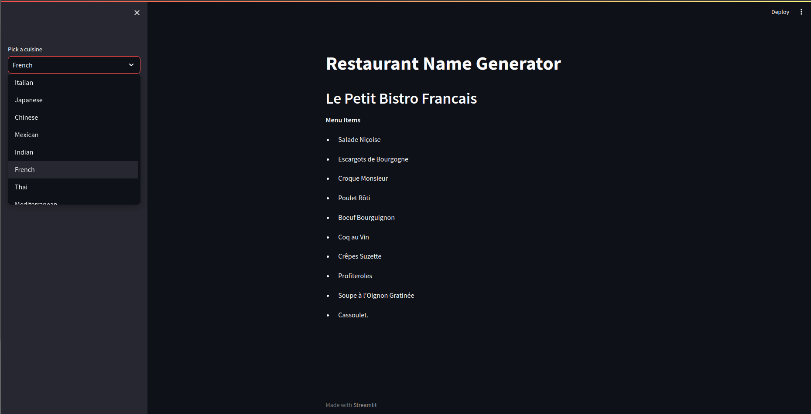

# Restaurant Name Generator


## Installation (Windows)
## Clone
```bash
$ git clone https://github.com/shreyahegde18/Restaurant_Name_Generator
```
## Change the directory
```bash
$ cd Restaurant_Name_Generator
```

## Activate Environment
```bash
$ langchain/Scripts/activate
```

## OpenAI Key
Get your own [OpenAI API Key](#https://openai.com/)

Add you openapi_key [here](secrete.py)

## Run
```bash
$ streamlit run main.py
```

## Installation (Linux)
## Clone
```bash
$ git clone https://github.com/shreyahegde18/Restaurant_Name_Generator
```
## Change the directory
```bash
$ cd Restaurant_Name_Generator
```

## Activate Environment
```bash
$ source langchain/bin/activate
```

## OpenAI Key
Get your own [OpenAI API Key](#https://openai.com/)

Add you openapi_key [here](secrete.py)

## Run
```bash
$ streamlit run main.py
```
### feel free to customize :)
